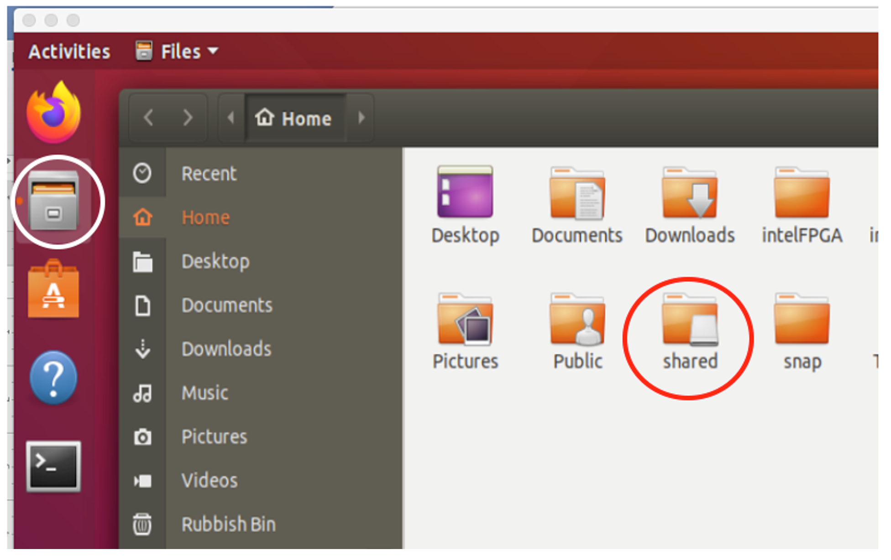
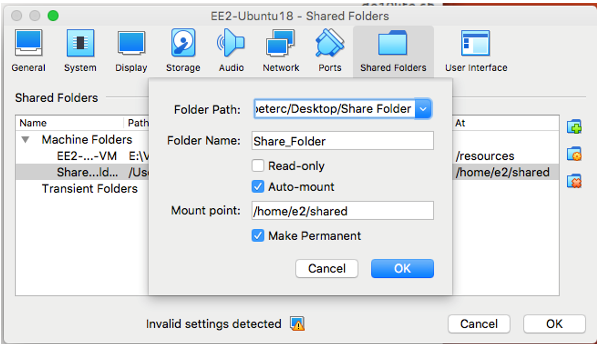
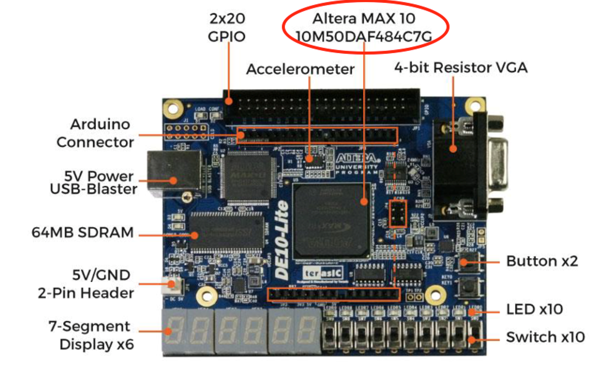
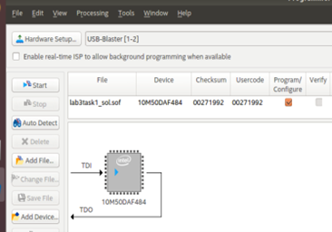
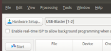

Department of Electrical & Electronic Engineering
Imperial College London


# Lab 1 – Introduction to DE10-Lite and Setting up Quartus Prime Lite

## Objectives

By the end of this experiment, you should have achieved:
*	Setting up the Quartus Prime Lite to run on your machine;
*	Create a directory structure for this and subsequent Labs;
*	Create a new project in Quartus and complete a basic 7-segment LED display decoder design using Quartus and Verilog from start to finish;
*	Program the Max 10 FPGA chip on the DE10-Lite board with your design;
*	Create another project to perform hexadecimal to BCD decoding;
*	Explore and test your decoder design.

### Installing Quartus Prime Lite

You will be using Intel/Altera software known as Quartus Prime Lite.  There are three ways you may achieve this: 

1. install the virtual machine Virtual Box and run Quartus Prime Lite under Ubuntu on your laptop; 
2. if you are running Windows 10 or Ubuntu, install Quartus Prime Lite from Intel/Altera natively on your machine without running any virtual machine at all 
3. install the virtual machine Virtual Box and run Quartus Prime Lite under Ubuntu on your laptop to download and run your design on the FPGA, but using the ee-mill3 servers for compilation.
4. Use the installation available in Level 1 machines. Please note that you need to have at least two nodes working in your system, so this option alone is not enough and it should be used alongside the other three methods.


Method 1 is platform independent but will run Quartus slower. If you are a Mac user , this is the best way!  

Method 2 is only for those who use Windows 10 or Linux on their laptops and want to run Quartus software natively and therefore should be faster. In either case, you will need to have at least 20GB free disk space and at least 4GB of RAM (preferably 8GB of RAM) on your machine. 

Method 3 copies all the steps of Method 1, but will compile all the code on ee-mill3 server. Method 3 is only recommended over Method 1 if your current machine is compiling too slowly.

### Method 1

Step 1: Download the following files:

1. 	Virtual Box from https://www.virtualbox.org/wiki/Downloads

2.	VirtualBox Extension Pack from:  https://www.virtualbox.org/wiki/Downloads

3.	Ubuntu and Quartus Prime Lite virtual machine image (.ova) from:
https://imperialcollegelondon.box.com/s/psvpgqpmvns1vje37uxs4dhxq2ktins2

(File name: EE2-Ubuntu18-Quartus20.1-IP-DSD.ova, 25.7GB)
These are large files. Make sure that you go somewhere with good WIFI connection. You only need to download these files once.  If want to reduce hard disk usage, you may off load these files to a USB or external drive.

Step 2: Install Virtual Box on your laptop, followed by the Extension Pack.  To install the Extension Pack, which is required for USB2/USB3 interfaces, you should go to Preferences.  Select Extension and then Add …  Then select the Extension Pack.

Step 3: Run the Virtual Box application and import the virtual machine image (.ova file).   This may take a few minutes.  Now start the virtual machine.

Step 4:  Log onto Ubuntu with user name: e2 and password: e2.  You should see a desktop similar to the one here.

Step 5:  First make a shared directory on your host system.  I suggest you put this on the host system Desktop.  We now create a shared folder between your host OS and Ubuntu.  Click on the Drawer icon, and then Home.  Create in this directory a new folder called “shared” as shown.  
Now go to Virtual Box Top menu bar and click Machine -> Settings.  A window will pop up and click Shared Folders icon and complete the fields in the popup form as shown.  Folder Path is where you put shared files on your laptop host.  You should use /home/e2/shared as your mount point.  You can now transfer files (such as screen images) between your laptop OS and Ubuntu.
 
Step 6: Start a terminal window on Ubuntu and enter the command:  quartus (RETURN). Quartus should now start running and you are ready to go!

Tips:  If you found that the VM window display is too small,  change the viewing option with:  View > Scaled Mode.

Depending on the resolution of your display and monitor, you may have to change the Video Memory size from 16MB to 64MB. 






### Method 2

**This method is only applicable if you have a Windows 10 or a Linux machine.**

Step 1: Go to https://www.intel.com/content/www/us/en/collections/products/fpga/software/downloads.html?edition=lite&platform=windows
Download Intel® Quartus® Prime Lite Edition Software (Device support included), the Multiple Download option would require a large file space (~15GB), so you may need to make sure you have enough disk space. One can also download only the Intel® Quartus® Prime (includes Nios II EDS) and Intel® MAX® FPGA device support from Individual Files (~8GB).

Step 2: You may be asked to complete a registration form and create your own individual account.  Make sure you use College’s email address.  You would then need to verify your identity through your College email.

Step 3: Go back to the link shown in Step 1, and now you should be able to download and install the Quartus Prime Software, the ModelSim simulator, and the Max10 device support.

Step 4:  Launch Quartus Prime Lite programme by clicking the icon.  The software should start. You are now ready to go!

### Method 3
Step 1: Follow all the steps from Method 1

Step 2: See the ‘UsingEEMILL3.pdf’ document on learn how to compile on the ee-mill servers and bring your data back to your host VM.

### The DE10-Lite FPGA Board

You have been loaned a DE10-Lite.  Connect the DE10 board to your machine using the USB cable provided.  You should see the board LED displays cycling through all digits, showing that the board is working properly.  The diagram below shows the features provided on this board.  Note that the FPGA chip is 10M50DAF484C7G.


 
## Task 0: Preparation

In task 1, you will use four slide switches on the right (SW3 to SW0) on the DE10 board as input, and display the 4-bit binary number as a hexadecimal digit on the right-most 7-segment display (HEX0). In task 0, you will check that everything is working properly by directly opening a pre-compiled `.sof` file. 


 
### Step 1:  Creating a good directory structure

Before you start carrying out any design for this Lab, it would be very helpful if you first create a directory structure for the labs. A possible directory structure is shown below: 

```bash
├── parent_dir 
    ├── lab1
    │   ├── task1
    |   │   ├── task1_top.sv
    |   |   └── others.sv
    │   ├── ...
    |   └── taskn
    ├── lab2 
    ├── lab3
    └── lab4
```
 
If you are using the virtual machine, create a directory structure under `/home/e2/E2_CAS`.  If you are using a Windows 10 machine, create this in a convenient location such as `C:/E2_CAS/`. We will use `parent_dir` to represent this parent directory.

### Step 2:  See what you are aiming for

Go to the course webpage and download a copy of the solution for Exercise 1: “lab1task1_sol.sof” to your folder for Lab1 (or wherever that is), it should be in the form of `parent_dir/lab1/task0`.  Make sure that your DE10 board is plugged in and running.

### Step 3:  Setting up programming hardware

Run Quartus software on your computer.  
Click command: Tools > Programmer.  
In the popup window, click: Hardware Setup ….  
You should see something like the diagram below.  
Then select: USB Blaster. This is to tell Quartus software that you are using the DE10 interface to program (or blast) the FPGA.  

If you do not see USB-Blaster under Hardware Setup although the DE10-Lite is plugged in properly, it is most likely that the Device Driver had not been installed or loaded properly. In which case, please see the instruction in the Appendix.



### Step 4: Blasting the FPGA

Next click the AddFile button. 

Navigate to the folder containing the lab1task1_sol.sof file.  Select this.  You should see a display like this:
 


Note that the device indicated here is the one on the DE10 board: 10M50DAF484.

Click the Start button.

The `lab1task1_sol.sof` file contains the solution to Task 1.  

It has the bit-stream to configure (or programme/blast) the FPGA Max10 chip. Once the bit-stream is successfully sent to the FPGA chip, the task1 design will take over the function of the chip.  You should be able to change the least significant four switches and see a hexadecimal number displayed on rightmost 7-segment display. Now you are ready to create this design from scratch.
 
## Task 1: The Design Flow – 7 Segment LED Display

### Step 5: Create the project “task1”

* Create in your home directory the folder `parent_dir/lab1/task1`.  
* Click file>New Project Wizard, complete the form. Use `task1` as the project name and `task1_top` as top-level design name.  
* Click Finish.
 
### Step 6: Device Assignment

Click Assignments -> Device, and select the Max 10 chip used in DE10, which is:  10M50DAF484C7G.  (Interpretation of the device code: 10M is Max10 family. 50 is the size of the device of around 50,000 logic elements.  484 is the number of pins.  C7 is the speed grade.)
 
### Step 7: Creating the Verilog specification
•	In Quartus, create a design file for the decoder module in Verilog HDL as hex_to_7seg.v using:
File >  New ….  and select Verilog HDL from the list.
•	Type the Verilog source file as shown here. Make sure that you pay attention to the syntax of Verilog.  Save your file.
•	At this stage, you check the syntax of your code by clicking:  Process > Analyze current file.  You should get into a habit of ALWAYS perform this step to make sure that the new Verilog module you have created is error free.  It will save you a lot of time later.
•	Click:  Project > Add Current file to Project to include this module in your design.
Step 8:  Create Top-Level Specification in Verilog
•	We need to create a top-level (at chip level) design that make sure of the decoder module. Create the file “task1_top.v” as shown here.  Specify that this is our top-level design with:  
Project > Set as Top-level Entity ….
•	Verify that everything works properly with:  Process > Start > Start analysis & elaboration. Make sure that there is no error.  (Warnings often capture potential errors.  However, the Quartus system generates many warnings, and nearly all of which are not important.  Once you have gain confidence in the system, you may start ignoring the warning, but never ignore any error.)

You will save a lot of time if you ALWAYS use these two steps: analyze, and analysis & elaboration, and ensure that ALL errors are dealt with (and warning understood).
Note:  Every time you create a new entity or module as part of your design, you must include the file in the project.
•	Click: Project > Add Current Files to Project ….,
 
Step 9: Pin assignment – the hard way
You need to associate your design with the physical pins of the Max 10 FPGA on the DE10 board.  We will now only assign two of 11 pins used in our design.
•	Click Assignment > Pin Planner   and a new window with the chip package diagram. You should also see the top-level input/output ports shown as a list.
 
•	Click on the field shown and select the appropriate values for Location and I/O standard.
•	Close the pin assignment window and click: File > open…  Enter *.* in the file name field and select: task1.qsf (qsf = Quartus Setting File).  Examine its contents.  You should see the effect of the manual pin assignment step as highlighted in RED.
•	The first line defines the physical pin location of HEX0[6]  is PIN_C17.
•	The second line defines the voltage standard used is 3.0V LVTTL.
 
Step 10: Pin Assignment – the easy way
•	Manual pin assignment is tedious and prone to errors.  A much better way to perform pin assignment is to insert a text file with the necessary information directly into the .qsf file.
•	Delete the four lines highlight above which was created through the manual pin assignment in Step 9.  
•	Download from the course webpage: pin_assignment.txt to the task1 folder.
•	Click:  Edit > Insert File …   and insert pin_assignment.txt at the end of the file.
ALL the pins used on the DE10 are assigned here. However, unused pins are ignored.
Step 11: Compile the design & Programming the FPGA
•	Click Process > Start Compilation.  This will perform all the steps of compilation, placement, routing, fitting etc. and produce a bit-stream file (.sof) ready to blast onto the FPGA.
•	Examine the Compilation Report and you should see a Flow Summary similar to the one shown here.  
 
•	This correctly shows that the design used 8 logic elements (out of nearly 50,000) and 11 pins.
•	Programme the DE10 with YOUR design with the file: task1_top.sof. (See Task 0 if you have forgotten how to do this.)   Test you design.

Congratulations! You have now completed your design from beginning to the end.

Put verified modules in mylib
For the rest of this module, you will design and verify various Verilog modules which you will reuse.  You should copy hex_to_7seg.v (and others in the future) to the “mylib” folder and include them in your new design as necessary.
Note:  When you perform a compilation, there may be a popup window informing you that some “Chain_x.cdf” file has been modified, and ask if you wish to save it. Just click NO.
 
Task 2: Explore Netlist Viewer and Timing Analyzer
Step 1:   Viewing the design
Quartus Prime provides a graphical view of the synthesized design. Exploring this provides you with some insight into how the Verilog HDL code is turned into actual FPGA hardware.
•	Click  Tools > Netlist Views > RTL Viewer
This should appear on your screen:
•	Push down into this block and investigate what is being displayed and how it relates to the decode logic.
RTL Viewer only shows the abstract Boolean description of the design, not the physical implementation on the FPGA.
•	Click  Tools > Netlist Views > Technology Map Viewer (post mapping)
Explain what you find and link this back to the Compilation Report.
Step 2:  Timing Analyzer

Click  Tools > Timing Analyzer

A Timing Analyzer window will appear.  
Now click Report datasheet.  The Timing Analyzer tool will provide datasheet type table showing the propagation delays of all the paths in your design

Study the results for worst-case delay at different temperature and explain what you found.


Step 3:   Test yourself
Create your own design in task2 folder (top-level file is task2_top.v) to display all 10-bit sliding switches as hexadecimal on three of the 7 segment LED displays.  


	
 
Appendix  - Installing USB-Blaster Device Drive under Windows 10
If you are using Quartus under the Virtual Machine, the driver should already been installed, and you should not need to do anything.
If you are installing Quartus directly to your PC running Windows 10, you may need to install the driver manually according to the following steps:
1.	Plug the USB-Blaster into your PC.
2.	Open the Device and Printers (Control Panel | Devices and Printers).
3.	Under Unspecified, USB Blaster should be listed. Right mouse click on this and then select Properties.
4.	Select the Hardware tab and select Properties.
5.	A new window should pop up with the General tab already selected. Select Change Settings.
6.	Again a new window should pop up with the General tab already selected. Select Update.
7.	Select Browse my computer for driver software.
8.	Find intelFPGA_lite\20.1\quartus\drivers\ 
	(Note 1: Your altera file is located at the location you selected when you first installed quartus. The location listed in this document is the default location)
	(Note 2: Stop at the drivers folder, i.e., do NOT go deeper by opening a folder within the drivers folder)
1.	Select OK. Make sure the proper path was selected then select Next.
2.	If the Windows security window pops up, check the Always trust software from “Altera Corporation” box and select Install.

